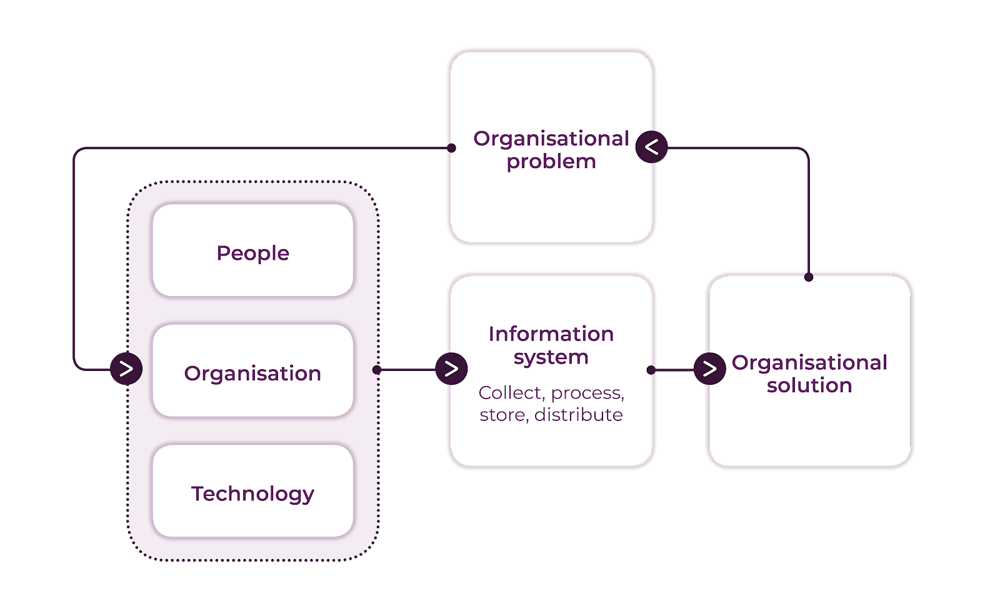

- [Waterholing](https://www.oreilly.com/library/view/cybersecurity-attack/9781788475297/9f193edd-e0d8-4ad8-bbc0-11678e996910.xhtml)
  id:: 63d7f820-b7b7-4901-bbb3-49aac96abb42
  > This is a social engineering attack that takes advantage of the amount 
  of trust that users give to websites they regularly visit, such as 
  interactive chat forums and exchange boards. Users on these websites are
   more likely to act in abnormally careless manners. Even the most 
  careful people, who avoid clicking links in emails, will not hesitate to
   click on links provided on these types of website. These websites are 
  referred to as watering holes because hackers trap their victims there 
  just as predators wait to catch their prey at watering holes. Here, 
  hackers exploit any vulnerabilities on the website, attack them, take 
  charge, and then inject code that infects visitors with malware or that 
  leads clicks to malicious pages.
- [Spear Phishing](https://www.oreilly.com/library/view/cybersecurity-attack/9781788475297/46b0717c-6884-48e7-9584-029219e7f2cc.xhtml)
  id:: 63d7f944-d682-4655-8835-a08a441ab6b7
  > This is also related to a normal phishing attack, but it does not send 
  out high volumes of emails in a random manner. Spear phishing is 
  specifically targeted to obtain information from particular end users in
   an organization. Spear phishing is more strenuous since it requires the
   attackers to perform a number of background checks on targets in order 
  to identify a victim that they can pursue. Attackers will then carefully
   craft an email that addresses something of interest to the target, 
  coercing him or her to open it.
- [Phishing](https://www.phishing.org/what-is-phishing)
  id:: 63d7f9a5-3ac3-441e-b0e6-a5f5174db499
  > Phishing is a cybercrime in which a target or targets are contacted by email, telephone or text message by someone posing as a legitimate institution to lure individuals into providing sensitive data such as personally
  identifiable information, banking and credit card details, and passwords.
- [Information System](https://moodle.port.ac.uk/mod/page/view.php?id=2595408)
  id:: 63e11f1a-c6b5-411c-a3cf-67488d3f7097
  Most of the the definitions of an IS suggest, that an IS is a group of components that interact to produce information. These components include:
	- **Hardware** (eg hard Disk Drive, Microprocessor, monitor, graphic card, ...)
	- **Software** (systems software, application software)
	- **Data** (that will be collected, analysed, distributed and stored)
	- **Network components** and **telecommunications** (to connect computers)
	- **People** (users, IT administrator, managers etc.)
- These five components are present in every IS, from the simplest to the most complex.
  