- Metadata:
	- [[Feb 2nd, 2023]]
	- Erik Bergström, JTH
- Information Security Risk Management (ISRM)
	- **Definitions from ISO/IEC**
		- ISO / IEC 27005
			- Risk Identification is the part of Information Classification / Evaluation
			- Rao, U.H., & Nayak, U. (2014) - The InfoSec handbook, Risk/ISRM processes cycle #toadd
			- Start at Classification, find out the value, then do the analysis
			- Feedback loop, review your results
		- ISO/IEC 27002, 2017 p. 15 #toadd 
		  IC has the objective to "ensure that information receives an appropriate level of protection in accordance with its importance to the organization"
		- ISO/IEC 27002, 2017, p. vi #toadd
		  The value of information goes bexond the written words, numbers and images knowledge concepts, ideas and brands are aexmaples of intangible forms of information. In an interconnected world, information and related processes, systems, networks and personnel involved in their operation, handling and protection are assets that , like other important business assets, are valueable to anorganizations busness and consequently deserve or require protection against various hazards.
	- **What is information classification?**
		- well-known practice, both in the priate and public sector
		- a part of standards such as ISO/IEC 27000 family, COBIT and NIST-SP800
		- under-researched area
		- mandatory in many countries
		- nput to risk analysis
		- GDPR is a driver
- Asset Management
	- Responsibility for assets
	  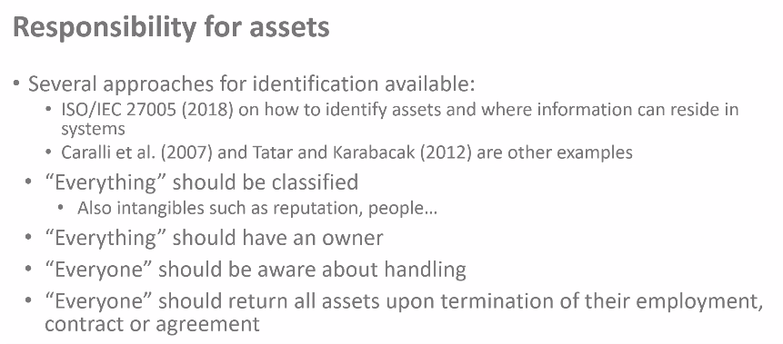{:height 255, :width 560}
		- Inventory of assets
			- Identify assets
			  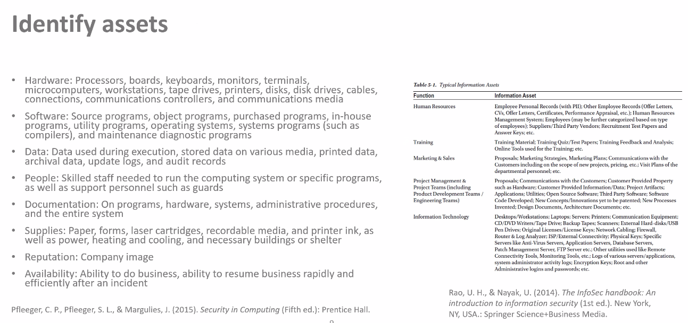
			  This is only a starting point, but not an optimal way.
			- Granularity
			  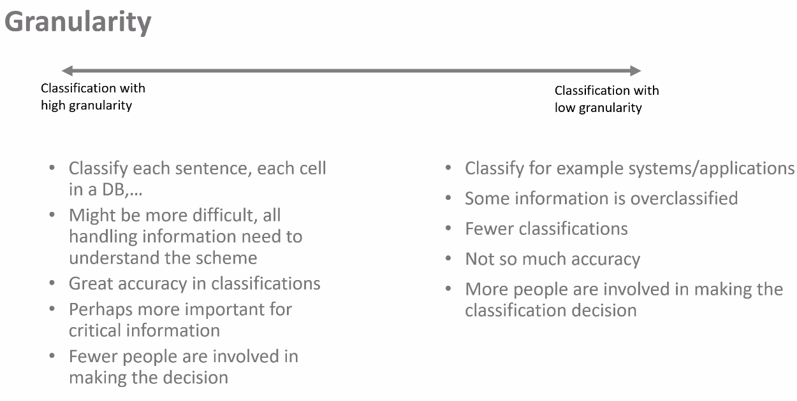
			  Most organizations start with low granularity, and go to high granularity when it comes to individual content that maybe needs to be classified.
		- Ownership of assets
		- Acceptable use of assets
		- Return of assets
		- -> **Lifecycle**
	- Information classification
		- Classification of information
		- Labelling of information
		- Handling of assets
	- media handling
		- Management of removable media
		- Disposal of Media
		- Physical media transfer
- Information Classification
	- Background
	- Problems
	  > Invent a data classification framework #idea
		- Little is known about practice
		- Much focus in research on intention rather than actual behaviour
		- many organizations struggle with classifications
		- turning standard into practice
		- lack of detailed guidelines
		- developing a classification scheme
		- subjective judgement
	- Dissecting the scheme
		- 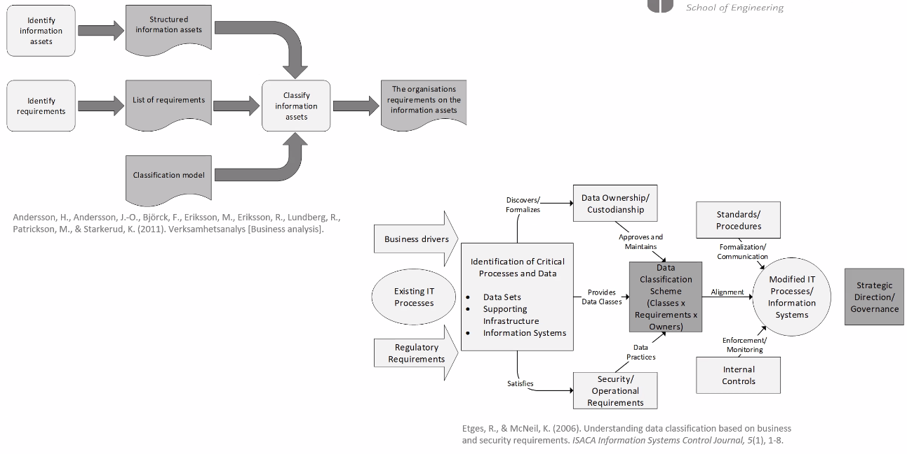{:height 275, :width 531}
	- Information Classification Scheme
		- Confidentiality, Integrity, Availability
		- Serious, Significant, Moderate, None or Insignificant
		- A good classification scheme needs to satisfy two contradicting conditions:
			- It needs to be simple so that it can be understood by the information owners and user
			- The classification scheme must not be oversimplified (Fibikova & Müller, 2011, p. 40) #toadd
		- What about the scheme?
			- Number of levels
			- Naming
			- Security aspects
			- Impact / Consequence
		- Government Security Classifications
			- 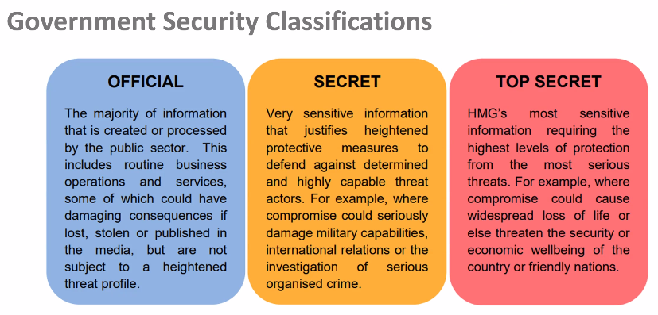
			  *Cabinet Office (2018). Government Security classifications May 2018 Version 1.1.* #toadd
		- Security aspects
			- 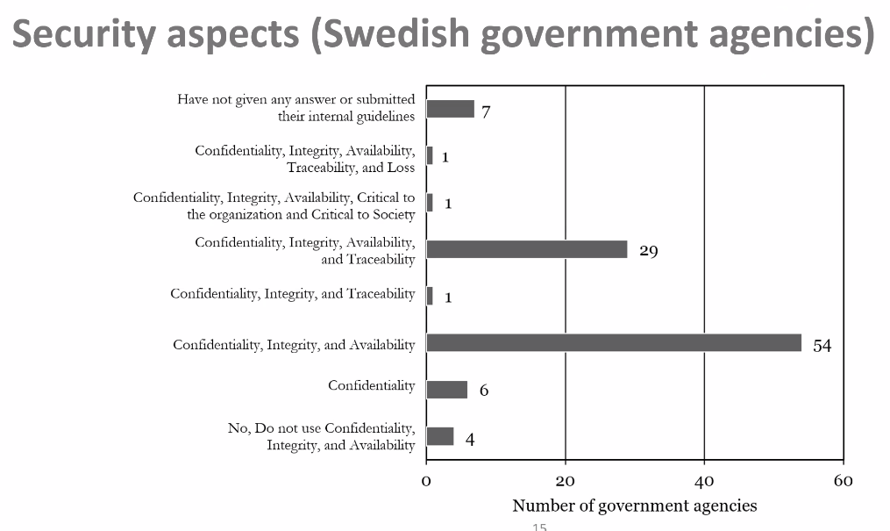
		- Consequences / perspectives:
			- 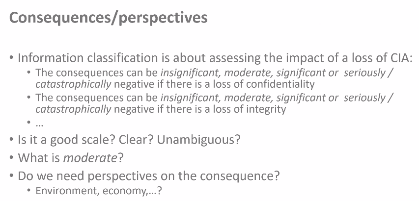
			- 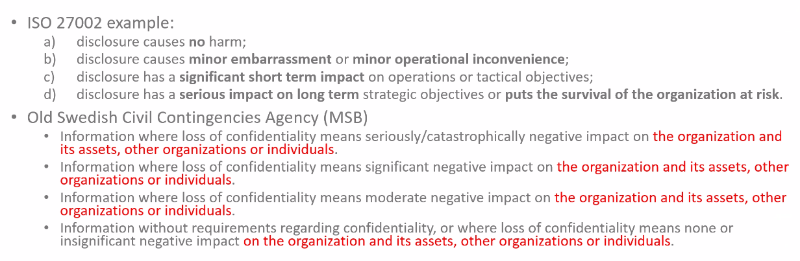
			- 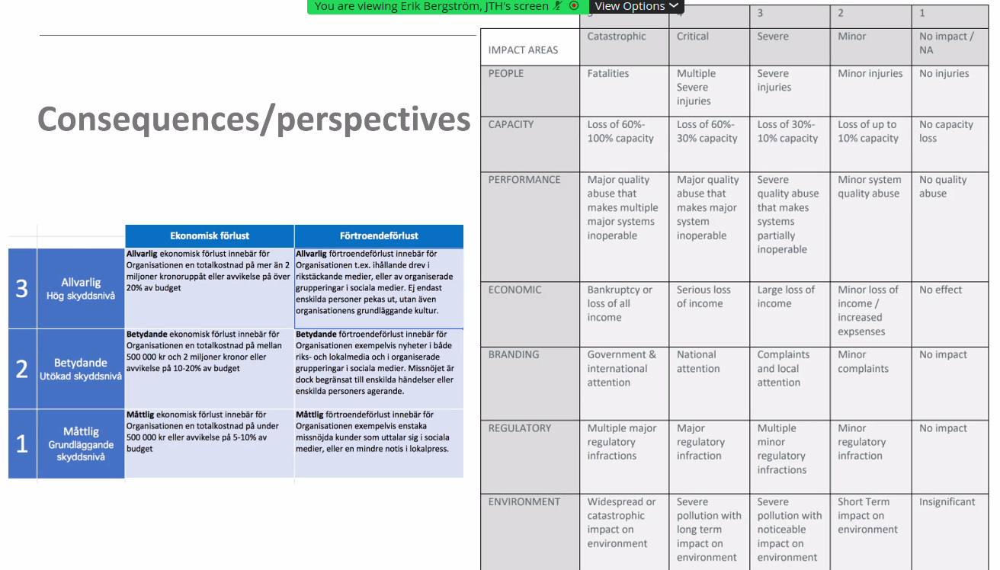
			- 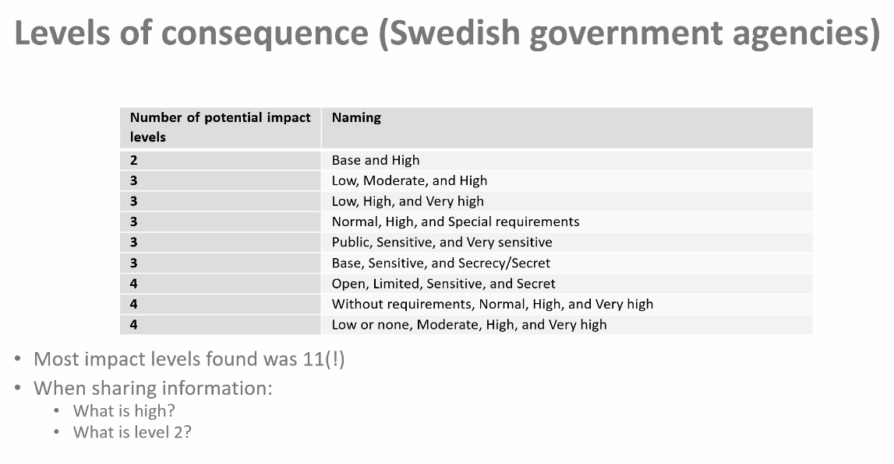
			- 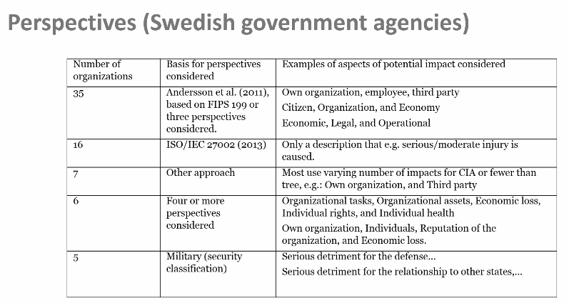
			- 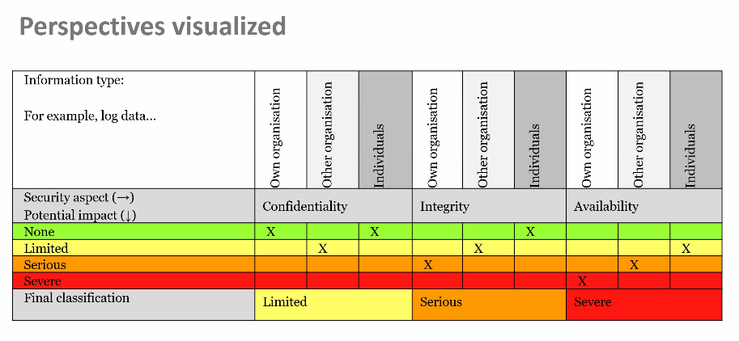
			- It's hard to assess how much the loss of a document really costs
		- What baout the classification result?
			- What is the result of a classification?
				- A number?
			- The result should be documented!
				- Where?
				- Who can access?
				- Synergies from previous information types?
			- Contextual information is important!
				- What contextual information?
		- Solutions
			- Important to identify stakeholders and champions
			- Management support
			- include the information life cycle in the process (how?)
			- Use the same schedule throughout the organisation
			- Use legislation as "motivation" - or not
			- Classify larger amounts of information (systems / applications)
			- Build a safety culture
			- Train staff
			- Use tools #question
			- Use a simple scheme - but not too simple... ;)
			-
- A method for information classification
	- 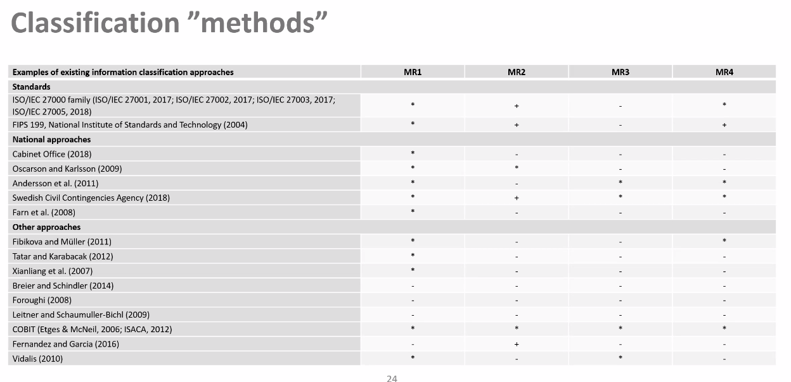
	- 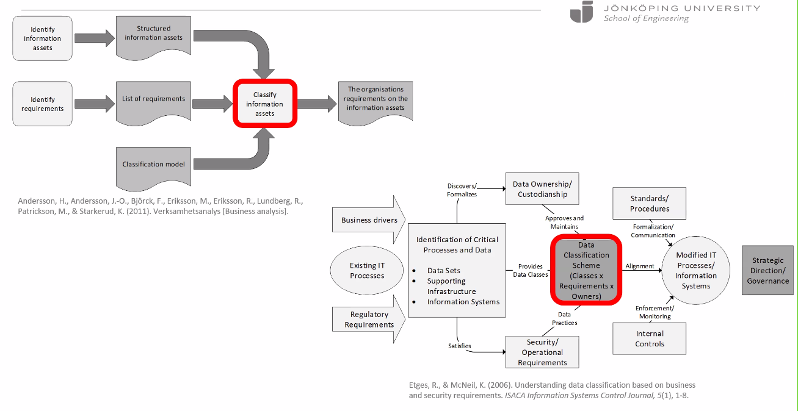
	- 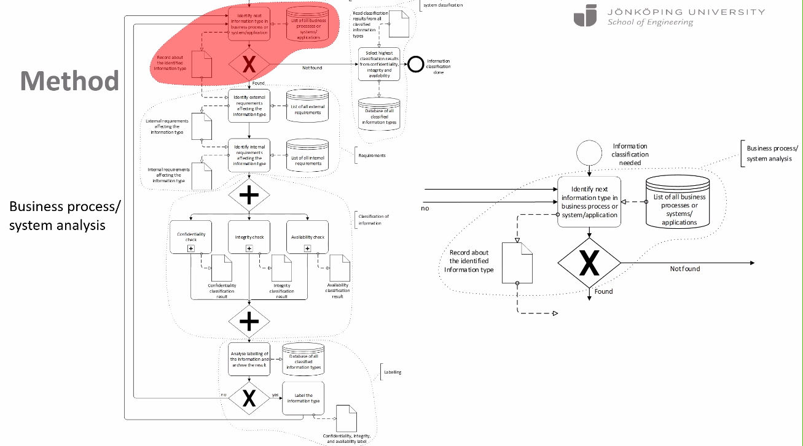
	- Every year there should be a reclassification, but normally, it's just done after an attack or after changing a system
	-