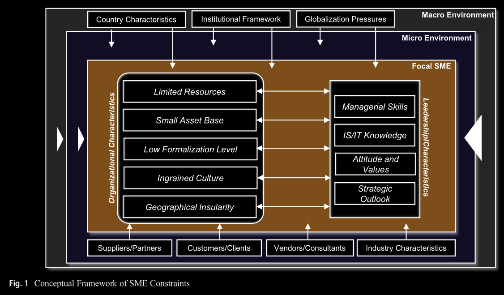

- ### Framework
	- represents a condensation of extant models and examinations performed by various researchers and practicioners (Boyes and Irani 2003; Caldeira and Ward 2003; Dojkoski et al. 2007; Chang and Wang 2011; Cragg et al. 2011; OECD 2017)
	- consistent with other organizational studies investigating the influence of internal and external characteristics in information technology
	- three layers:
		- **Macro Environment** (outer layer)
		  collapsed:: true
			- comprises country characteristics like
				- national culture
				- institutional framework in terms of legal regulations
				- globalization pressures being not necessarily specific to the SME context
			- Example (Chen et al. 2007; Piscitello and Sgobbi 2004):
				- legal changes where compliance is potentially more difficult for SME due to a lack of available legal staff and expertise
				- hindered access to foreign markets due to a dependence on trading partners and lower trading power
		- **Micro Environment** (middle layer)
		  collapsed:: true
			- direct periphery of the SME
				- suppliers and partners
				- customers and clients
				- vendors and consultants
				- general industry-specific characteristics which affect the enterprise through competitive pressure (Melville et al. 2004; Stockdale and Standing 2006; Teo et al. 2004)
			- Example (Casterella et al. 2004):
				- SME are particularly pressured due to their position at the end of the value and supply chain
		- **Focal SME** (inner layer)
			- consists of distinct
				- organizational characteristics
				- leadership characteristics
			- which are interrelated and influenced by the respective micro and macro environment of the focal SME (Chell et al. 1991; MacGregor and Vrazalic 2005)
			- leadership characteristics of the owner-manager or managing director and organizational characteristics strongly influence how the focal SME operates and how investment decisions are made within the enterprise
	- 