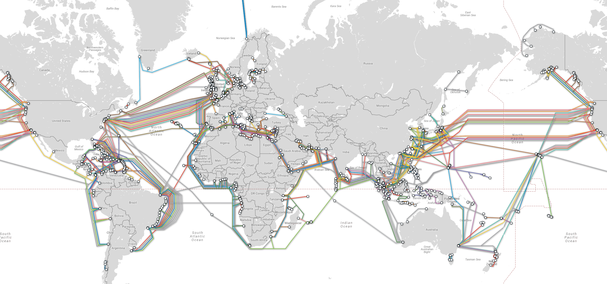

- 
- ### Introduction
	- *»Every sailor knows that you cannot have the sea without the waves«*
- ### Global Security Issues
	- Live cyberthreat maps:
		- Fireeye: [Cyber Threat Map](https://www.fireeye.com/cyber-map/threat-map.html)
		- Cyberthreat: [Real Time Map](https://cybermap.kaspersky.com/)
		- CheckPoint: [Threat Map](https://threatmap.checkpoint.com/ThreatPortal/livemap.html)
- ### Examples of High Profile Security Breaches
	- Facebook 2017, Russia used social media to influence the election of the president in the US. See this [case study](https://www.bbc.co.uk/news/technology-41469361) by the BBC.
	- Additional Resources regarding high profile security breaches:
		- “The 15 biggest [data breaches](https://www.csoonline.com/article/2130877/the-biggest-data-breaches-of-the-21st-century.html) of the 21st century”
		- Listen to this podcast: {{embed ((63d443cb-47d1-4943-bef3-c9392e4549c0)) }}
		- Familiarise yourself with a number of technical terms relating to cyber security and consult [Sophos Threatsaurus](https://ugc.futurelearn.com/uploads/files/3f/d3/3fd36a66-d941-4595-b587-1a7b41998ae9/Week_3_Sophos_Threatsaurus_AZ.pdf) which provides an A–Z glossary on computer and data security threats.
- ### Globalisation and Information Technologies
	- #### What is Globalisation
		- **Definition in economic perspective** #definition
		  There's no internationally agreed version.
		  > [...] economic phenomenon meaning the move for more free international trade. In this perspective, international institutions / agreements [...] play a crucial role in reducing barriers [...] and influence global production processes and international division of labour.
		- **Pro**
		  limitless opportunities and benefits or businesses and states
		- **Contra**
		  destroys local economic development and worsens working conditions for the poor
		- **Ritzer (2009)** #definition
		  > G is associated with an increasing multidirectional flow of things, people and *information* across the planet.
		- Increasing interconnection (supp. by ICT) = more complexity and uncertainty, due to boundaries of problem spaces have become immensely broader
		- Cyberspace is an open system
		- Cyber Threats can have a global impact even when a risk point is thousands of miles away. (ICT has contributed to the *"butterfly effect"*)
		- There is a need to acknowledge the systemic nature of security risks. Systemic analysis' would result in better understanding of root causes of cyber threats and in more holistic security solutions.
	- #### The Infrastructure of an Interconnected Cyberspace
	  {:height 269, :width 556}
	  This map shows the world's network of undersea cables.
		- Creation / Development of a global and interconnected cyberspace is supported by a number of ICT (Information Communication Technologies).
		- Fibre optic cables form the backbone of the internet (massive quantities of data are transmitted fast and cost effective)
		- Global scope of telecommunications includes an expansive network of orbiting satellites used for TV, telephone, radio, internet and military applications.
	- ### The History of the Internet
	  {{video https://youtu.be/VkmSjfPfXXI}}
	- ### Cyberspace
		- The four layers of cyberspace #definition, vulnerabilities described by *Whyte and Mazanec (2019)* in {{embed ((63d3bf58-43ff-418e-a065-97d81556a92f)) }}
			- **Physical Layer**
			  > The physical layer consists of the physical devices, such as PCs, networks, wires, grids and routers. These physical devices are located within jurisdictions, which is important for law enforcement when they search for physical devices used to run criminal enterprises and other cybercrimes.
			  
			  Vulnerabilities:
				- Submarine cables could be attacked
					- mined/attacked by naval vessels in the event of war
					- attacks on the landing zone of the cable where they come on the shore
			- **Logic Layer**
			  > The logic layer is where the platform nature of the Internet is defined and created. Stated differently, cyberspace depends on the design of the Internet. It is built out of components that provide services for users, such as social media, content, shopping, etc.
			- **Information layer**
			  > The information layer includes the creation and distribution of information and interaction between users. Users can create information by building a website, linking to other websites, and posting information on social media websites such as Twitter, Facebook or Yelp. Users can also access information, including music, books, videos and pictures.
			- **Personal Layer**
			  > The top layer consists of people - people who create websites, tweet, blog and buy goods online.
		- Cyberspace architecture is of complex nature, since different entities / stakeholders with different motivations / objectives / agendas interact / influence activities within cyberspace.
		- Developing / Implementing security policies / strategies is problematic / challenging.
	- **Cyberspace as a complex socio-technical domain**
		- achieves importance through human design / implementation
		- despite cyber being technical, cyberspace is a domain of human activity / interactions
		- centrality of humans in cyberspace makes social approaches imperatove to the study of cyber security.
		-
- ### Activities
	- **Forum Activity**
		- Today we start by exploring recent, significant cyber incidents that catch your attention. The [CSIS list](https://www.csis.org/programs/technology-policy-program/significant-cyber-incidents) below details all significant cyber incidents since 2006. Read through the list, and select three events which interest you.
			- Why did they catch your attention?
			- What is the significance of these incidents?
			- How might this affect global security policy and considerations?
		- Please post your thoughts into the discussion forum below (250 words).
		  Read and comment on the posts of at least two of your fellow classmates.
	- **Challenge Activity**
		- asd