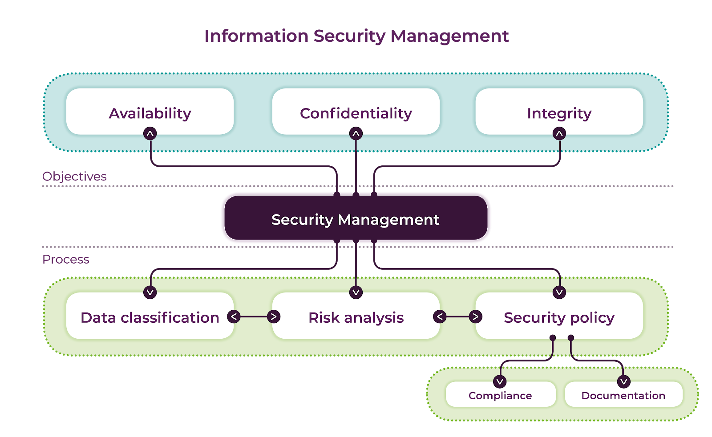

- ### Organisational Information Systems
	- Definition: ((63e11f1a-c6b5-411c-a3cf-67488d3f7097)) aligned with the definition of ((63e121aa-e73f-4866-ac01-c421a3513c2e))
	- The most important point in those definitions is that these definitions outline the existence of a large variety of interest groups that have the potential to significantly influence the development, the management and the implementation of an IS. this often results in complex managerial issues due to conflicting agendas of the different stakeholders.
- ### Types of Information Systems
	- There are different types of IS supporting business processes at different organisational levels:
		- **Functional Information Systems**
		  From an historical perspective, functional IS were the first kinds of systems developed to support business functions. These systems are located in specific departments such as accounting, marketing or HR.
			- **Sales and marketing IS**
				- To monitor transactions and to provide data
				- To help management analysing sales trends and the effectiveness of marketing campaigns
			- **Manufacturing and production systems**
			- **Finance and accounting systems**
				- Keep track of the business's financial assets and fund flows
			- **Human resources systems**
				- Maintaining employee records
				- Tracking employee skills, job performance
		- **Decision Support Systems**
		  Decision support systems include a large variety of systems to assist with monitoring (reports on the organisation's current performance), decision making and administrative activities. In particular, expert systems and knowledge Management systems use more sophisticated indexation techniques of data to support decision-making processes.
			- Provide routine reports and summaries of transaction-level data to middle and operational level managers
			- Provide analytical models or tools for analysing larger quantities of data
			- Expert systems (AI)
			- Knowledge management systems
- ### Information Systems Paradigms
	- The definition of an IS as a system in which data is processed to achieve efficient / effective organisational goals is commonly accepted. However, there are two dominant paradigms in information system discipline.
	- **Data Processing Systems**
		- #toadd
	- **Human Activity Systems**
		- #toadd
- ### User Design Communications Gap
	- The development of an IS is often problematic as it involves many different stakeholders with different expectations and needs. With so many differing requirements to consider, designing a system which can meet these expectations can often be a challenge. Below are examples of different common concerns formulated by users and designers.
	- **User concerns**
		- Will the system deliver the data i need for my work?
		- How quickly can I access the data?
		- How easily can I retrieve the data?
		- How much clerical support will I need to enter the data into the system?
		- How will the operation of the system fit into my daily business schedule?
	- **Designer concerns**
		- How much disk storage space will the master file consume?
		- How may lines of program code will it take to perform this function?
		- How can we cut down on CPU?
		- What is the omst efficient way of storing the data?
		- What database management system should we use?
- ### Information Security Management - Key Principles
	- Definition of ((63e128a7-ef7f-47c6-ae96-cacb2227d825)))
	- The International Standard for Information Security Management Systems is ISO/IEC 27001:2013, in particular ISO/IEC 27000, 27001, 27002 and 27005.
	  ISO/IEC 27000 is the root for a whole numbered series of international standards for the management of information security.
	- involves risk analysis process that identifies different vulnerabilities / threats
	- based on the risk analysis outputs, a security policy can be developed and implemented to prevent, reduce and mitigate security risks
	- 
		- **The CIA Triage**
			- Information risks can affect one or more of the there fundamental attributes of an information asset - its availability, confidentiality and integrity (CIA Triage as its defined in ISO/IEC 27002).
			- **Confidentiality**
			  > ensuring that information is accessible only to those authorised to have access
			- **Integrity**
			  > safeguarding the accuracy and completeness of information and processing methods
			- **Availability**
			  > ensuring that authorised users have access to information and associated assets when required
		- Definition of an ((63e12b6a-258c-4cf9-a4b4-c8c6bd26f080))
	- **Additional resources**
		- Overview of ISO/IEC 27000 family
		  ((63e1266c-94eb-4759-83f7-ad10fce476f1))
		- Questioning the relevance and applicability of IS standards
		  ((63e12f72-26f0-49e0-9734-4b48ace4fb63))
- ### Data Assets Classification
	- Classification of data according to their business sensitivity and importance is needed to ensure appropriate and effective protection (top secret / secret / classified / unclassified). It helps to optimise the cost of protection solutions / measures. Classified data serves as an input to the risk analysis process (see Week 3 #toadd )
	- In context of [ISO / IEC 27002:2005](https://www.sciencedirect.com/science/article/pii/S0167404813000801?casa_token=WsXRP2vDTBkAAAAA:I6X1SHVJQIkmadmPa52nPf_T1aQifXeVI_e55Mzql5ftdMnCtcVcPDQvxP-dN5uU-tMxzjWaMQ), data can take on many forms. it can be printed or written on paper stored electronically, transmitted by post or electronic means, shown on films, conveyed in conversation, and so forth ([ISO/IEC 27002:2005, p1](https://www.sciencedirect.com/science/article/pii/S0167404813000801?casa_token=WsXRP2vDTBkAAAAA:I6X1SHVJQIkmadmPa52nPf_T1aQifXeVI_e55Mzql5ftdMnCtcVcPDQvxP-dN5uU-tMxzjWaMQ))
	- Effective data classification requires an important investment in inventory of all types of storable / usable data.
	- Formally allocate responsibilities for data ownership and protection to ensure effective data management is crucial.
	- Problem: "the standard described the practice of information classification in a general and universal manner without explaining how the practice could be accomplished in any particular organisation" (Niemimaa and Niemimaa (2017, p. 6))
- ### Activities
	- **Forum Activity**: [Google Docs](https://docs.google.com/document/d/1ts6-Ncg5iapZaYZ-lzImftU3p_cltFYNPoFuo_0RRCs/edit)
	- **Challenge Activity**: [Google Docs](https://docs.google.com/document/d/1TSXTNUu4XFFFc4UvRGOpMUSDDJeQhFOMytydoRNmhAs/edit)