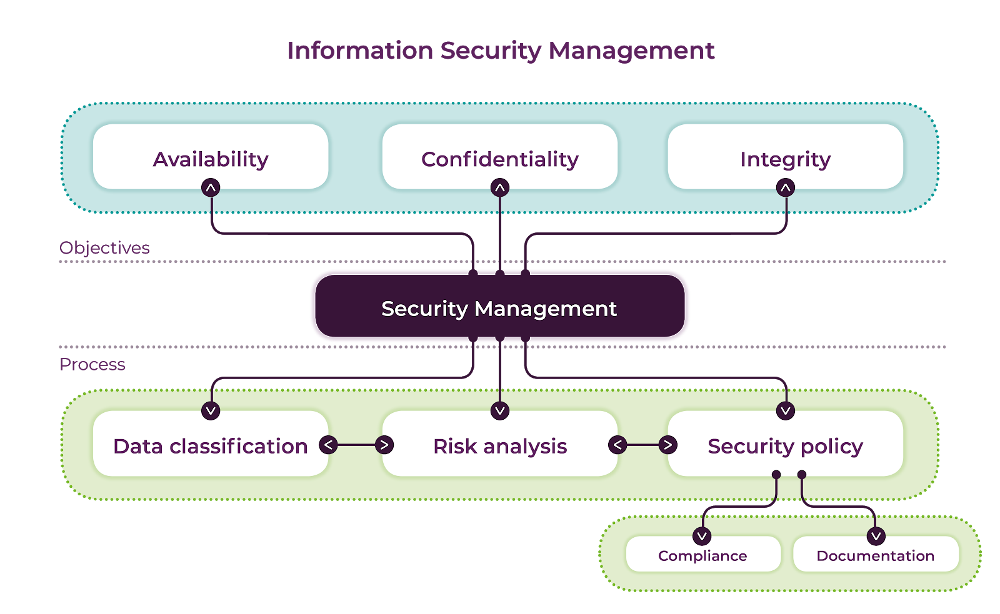
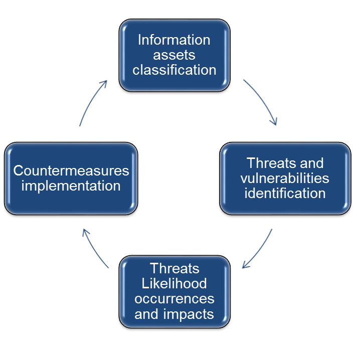
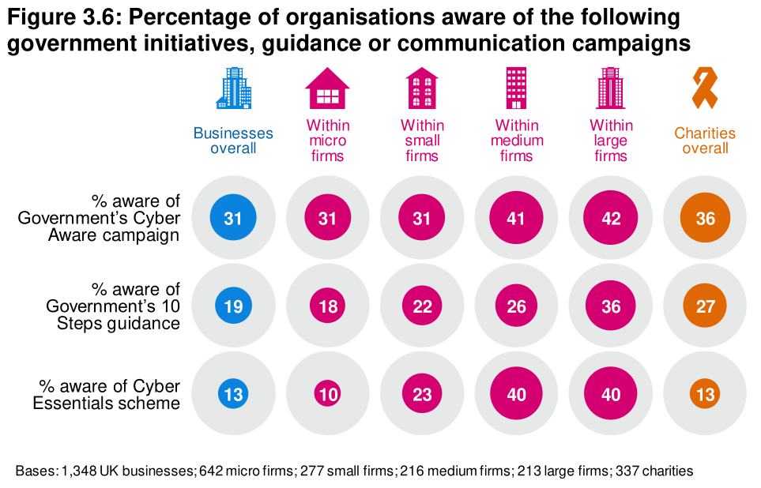
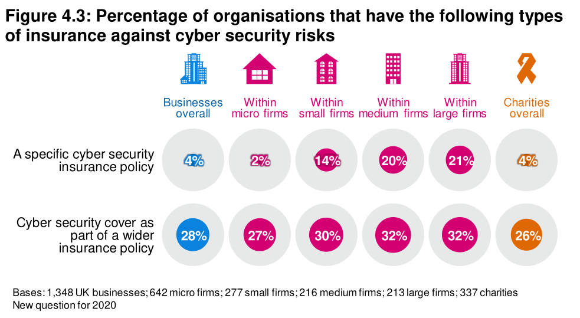

- ### Lecture - Information Security Management (ISM)
	- **Recap**:
		- > ISM aims at ensuring the availability, confidentiality and integrity of information.
		- To achieve these objectives, the following steps need to be undertaken:
			- **Data** needs to be classified according to its sensitivity (see #[[Week 2: Information Security Management]])
			- **Risk analysis process** needs to be in place (see current sheet)
			- **Security Policy** needs to be developed and implemented (see #[[Week 4: Information Security Policy]])
		- 
- ### Risk Analysis Process
	- Risk analysis is dependent on information classification; deficiencies in data classification would lead to inaccurate and ill-defined risk assessments.
	- ISO / IEC 27005 provides guidance to develop risk assessment methodology and to implement the requirements mandated by ISO / IEC 27001. ISO / IEC 27002 offers assessment guidance and recommends an alignment between the risk analysis approach and the organisation's business and risk environment.
	- Four key steps can be identified in common risk analysis frameworks.
	  
	  1. Classification of data assets according to their sensitivity
	  2. Identification of threats and vulnerabilities
	  3. Likelihood occurrences and impact estimation of these threats
	  4. Implementation of security controls at an acceptable cost
	- Risk analysis should be a continuous process to monitor the effectiveness of implemented security controls as well as to develop proactive and resilient security capabilities.
	- Based on risk analysis, the management of security risks involves the following decisions:
		- **Avoidance**: either the source of the risk is removed, or plans are adjusted to ensure that the risk does not occur
		- **Transfer**: The liability for dealing with the risk is moved to, or shared with, a third party
		- **Mitigate**: reduce the probability of the risk occurring or the possible negative consequences if the risk does occur
		- **Accept**: decide not to do anything about the risk. If the risk does occur, a workaround will be developed at that time
		- **Increase**: decide to take on more risk to pursue an opportunity
- ### Vulnerabilities
	- The identification of vulnerabilities is the first step in a risk analysis process.
	- ISO standard defines vulnerability as: "a **weakness** of an asset or group of assets that can be exploited by a **threat**".
	- Security vulnerabilities can be
		- **Technical** - associated with the design / implementation of the hardware, the software and / or the network
		- **Human** - such as inadequate security awareness and training
		- **Organisational** - such as lack of regular monitoring, weak governance, unclear security policy and can result from flaws in security procedures, design and / or implementation
	-
- ### Identification of Threat
	- ISO standard defines threat as: "a potential **cause** of an unwanted incident, which may result in **harm** to a **system** or **organisation**".
	- Common security threat sources include:
		- **Natural Threats** Floods, earthquakes, tornadoes, landslides, avalanches, electrical stormes
		- **Environmental Threats**: Long-term power failure, pollution, chemicals, liquid leakage
		- **Human Threats**: Events that are either enabled by or caused by human beings, such as:
			- Unintentional acts (e.g. inadvertent data entry)
			- Deliberate actions (e.g. network based attacks, malicious software upload, unauthorised access to confidential information)
	- **Human threats**
	  The table below shows some examples of human threats:
	  | Threat-Source | Motivation | Threat Actions |
	  | --- | --- | --- |
	  | Hacker, criminal | Challenge, Ego, Rebellion | Hacking, Social Engineering, System intrusion/break-ins, Unauthorised system access |
	  | Computer criminal | Destruction of information, illegal information disclosure, monetary gain, unauthorised data alteration | computer crime (e.g. cyber stalking), fraudulent act (e.g. replay, impersonation, interception), information bribery, spoofing, system intrusion |
	  | Terrorist | Blackmail, Destruction, Exploitation, Revenge | Bomb/Terrorism, Information warfare, system attack (DDoS), system penetration, system tampering |
	  | Industrial espionage (companies, foreign governments, other government interests) | competitive advantage, economic espionage | Economic exploitation, information theft, intrusion on personal privacy, social engineering, system penetration, unauthorised system access (access to classified, proprietary and / or technology-related information) |
	  | Insiders (poorly trained, disgruntled, malicious, negligent, dishonest or terminated employees) | Curiosity, ego, intelligence, monetary gain, revenge, unintentional errors and omissions (e.g. data entry error, programming error) | Assault on employee, blackmail, browsing of proprietary information, computer abuse, fraud and theft, information bribery, input of falsified / corrupted data, interception, malicious code (e.g. virus, logic bomb, Trojan horse), sale of personal information, system bugs, system intrusion, system sabotage, unauthorised system access |
- ### Security Risk Assessment
	- ISO defines information security risks as the "potential that **threats** will exploit **vulnerabilities** of an information asset or group of information assets and thereby cause harm to an organisation."
	- Once a number of vulnerabilities and threats are identified, an organisation can calculate and estimate security risk.
	- difficult to achieve and problematic at times:
		- exhaustive identification of all vulnerabilities (technical, human, organisational) is impossible due to the evolving / changing business and technological environments.
		- identification of threats is not exhaustive as the form and sources of threats are evolving and difficult to predict
	- Organisations need to make strategic decisions when it comes to risk acceptance. ISO / IEC 27001 requires the organisation to define the risk acceptance criteria and the criteria for performing security risk assessments. The definition of these criteria is contextually dependent and must take the business needs of the organisation into consideration.
	- **Challenges**
		- Research in IS suggests that there is a gap between formal and actual processes in ISM and that it is difficult / challenging to implement standards in practice. Source: ((63e65e4b-c642-4333-9b39-70cdc5bfb70b))
		- Challenges associated with security risk analysis are far from resolved. Surveys reveal a poor effectiveness of ISM processes and indicate that organisations experience difficulties in assessing and managing their security risks, in implementing appropriate security controls, as well as in preventing security threats.
- ### Activities
	- #[[Forum Activity]] ([Google Docs](https://docs.google.com/document/d/194mtwoydFvTI5nNkHsmHtd6QWV-9rWD3P0w26c4GwcE/edit))
	- #[[Challenge Activity]] ([Google Docs](https://docs.google.com/document/d/1SCXLOignUnrufsUFplIZzmF9hsGBKTYr4f95eJTQIYg)
	  ((63e66271-dbf8-4318-bae3-7d85b4683831)) )
	  
	  