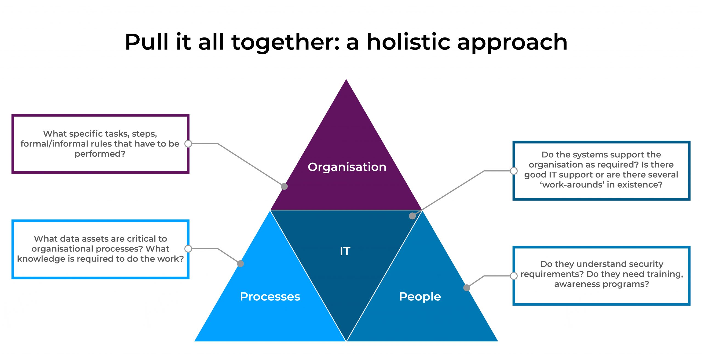

- ### Lecture: Security Policy Components
	- > The development of a security policy is a cornerstone in ISM
	- Based on risk analysis, a security policy determines the critical assets that need to be protected, and includes procedures and control measures to prevent and respond to security incidents and breaches.
	- ISO/IEC 27002 stipulates that the objective of SP is to provide management direction and support for IS in agreement with business requirements and relevant laws and regulations.
	- **Components of SP**
	  According to ISO/IEC 27002, an organisational SP needs to include at least the following:
		- **Access Control**: Access rules and rights to sensitive information should be exhaustively defined and documented taking into account business requirements for access. A control system against unauthorised access should be put in place to manage user privileges, networked services and operating system access. It is also important to implement a monitoring system to detect early signs of anomalies or abuse of privileges.
		- **Definition and allocation of responsibilities**: The security policy must clearly specify roles and responsibilities for information management across the organisation. Personnel in charge of ISM develop, implement and maintain security controls. their responsibility and authority areas should be clearly stated and documented.
		- **Information security awareness, education, and training**: Managers and technical personnel misbehaviour, due to social engineering, human errors, abuse of privileges and trust, could cause unexpected damages. therefore, it should be necessary to ensure that all work system users understand and follow security rules and to enhance employees' security consciousness by means of education and training.
	- For example, all users should be made aware of the procedures for reporting security incidents, and should be required to report such incidents as quickly as possible. Additionally, users should be informed regularly on the updates of the security policy including security requirements, legal responsibilities and business controls in order to prevent or limit potential security risks.
	-
	- **Reflection**
	  Read this research paper and reflect upon the successful factors of awareness campaigns.
		- **Source**: ((63ef92ce-df19-483c-9fcd-1036546def28))
- ### Physical and Environmental Security
	- A SP should specify physical and environmental facilities for protecting sensitive information against environmental threats and unauthorised access. this includes the definition of physical security areas, physical entry controls, equipment protection and maintenancen
	- **Security incidents response**: The SP should outline the specific actions to minimise the damage caused by security incidents. This includes monitoring, mitigation and investigation activities that should be assigned to an Incident Response Team (IRT). Security monitoring is particularly important since network attacks are growing in number and severity and information protection is requested to cope with newly created attacks. When a security policy has been implemented, it must be periodically assessed to ensure that all system components operate safely. The IRT is in charge of identifying attacks by analysing data collected by the detection systems to reduce the attack impact, and to make the appropriate decision for protecting sensitive data. Therefore, appropriate organisational and managerial procedures should be established for gathering, analysing and archiving digital evidences.
	- The development of a SP must take into account **the regulatory, statutory and contractual requirements**. Effective controls and appropriate procedures should be implemented and monitored to ensure that information are managed in compliance with legal restrictions. For example, authentication techniques, electronic signature, traceability and storage of attack evidences must be certified and audited by legal and recognised institutions. Moreover, the SP should address relevant legislation related to the appropriate business use of information assets to ensure the intelligibility of the production and operating mechanisms of business information.
	- A fully **documented process** should support the statement of SP objectives and scope, the implementation of operating procedures, and should describe with thorough instructions how to implement all the aforementioned components. SP documents should include in particular, authentication procedures, roles and responsibilities definition, awareness and training programs planning, monitoring actions, business recovery measures and sanctions associated with policy violations.
	- The **documentation** should be complete, coherent, easy to use and accurate. Specific parts of the SP documents should be communicated to all employees and relevant external/trading partners.
- ### Issues in Practice
	- While security risks and financial costs of cybercrime continue to escalate, security practices and strategies have not adequately kept up with the dynamic and challenging. According to many security reports an important percentage of the interviewed enterprise have preceded to the formalisation of their security policies (e.g. ((63e66271-dbf8-4318-bae3-7d85b4683831))). Investment in ongoing education and awareness programmes continue to expand.
	- However, the existence of a SP by itself does not mean its efficient implementation or relevance from users'  perspective. The effectiveness of training and awareness sessions is questionable if the number of staff-related security incidents continue to increase. An important percentage of companies where security policy was poorly understood had staff-related breaches, but also in a number of organisations where SP is understood still had a breach. A significant percentage of organisations attributed the cause to inadvertent human error.
	- In ((63e66ba2-739b-4f7d-bc76-b0e6a62c5a0d)) a comprehensive review of security surveys has highlighted a number of gaps or shortfalls in security practices. Essentially, their analysis shows a continuous technical focus on data system security, rather than on real world organisational context as well as a prevalent top-down approach. The analysis also found that the strongest influence on security policy definition came from IT directors and top managers. Further, many of the information security models and frameworks focus on technical modules and pay scant attention to the influence of contextual variables ( ((63e12f72-26f0-49e0-9734-4b48ace4fb63)) ).
- ### Socio-Technical Approach to Information Security Management
  
	- A ((63efa1e8-bd3e-494f-9259-21348b7753b9)) perspective on IS provides an alternative view to consider the reciprocal relationships between human factors and the technology with which they engage in the workplace. A socio-technical approach to IS stresses the importance of a thorough understanding of working practices in order to justify the relevance of security controls from user's point of view.
	- Research in IS has suggested that when employees regard security requirements as impossible or unnecessary they will either ignore or attempt to circumvent them. In Balozian and Leidner (2017), the authors do not question the need for SP but argue that more security measures may be counterproductive. In fact, even when security professionals have designed and/or developed excellent solutions, implementation can fail if efforts at change management are inadequate. Therefore, security professionals should not only explain how to comply with new security controls, but they need to make the extra effort to clearly justify the relevance of these controls. The use of channels of communication is necessary to reach and explain the why and how behind security measures.
	- Exclusive emphasis on a technology-centred view as well as centralised security controls and top-down management may lead to flaws in the design and implementation of security solutions. By failing to appreciate the complex relationships between use, usability and usefulness, imposed security procedures are not only subject to possible misuse but hey are likely to create difficulties for work functionality and efficiency (Kolkowska and Dhillon, 2013; Koppel et al., 2015). The weakest link is not necessarily in the technical system itself but the difference between the formal model of usage and real usage of system content (data) as such in a human activity system.
	- To attempt to explain why deficiencies in the practice of IS occur, a socio-technical approach offers the potential to bridge the gap between design and implementation of secure and usable IS. This suggests that an integrative and multi-layered approach to IS should include human, organisational and technical factors in the design and management of a secure and usable IS (Coles-Kemp, 2009; Furnell and clarke, 2012; Sadok et al., 2020)
	-
	-
	-
- ### Activities
	- Forum Activity ([Google Docs]())
	- Challenge Activity ([Google Docs]())
		- **Paper**: ((63e6647e-a581-4cbf-b167-03ede3f44f7e))
	-